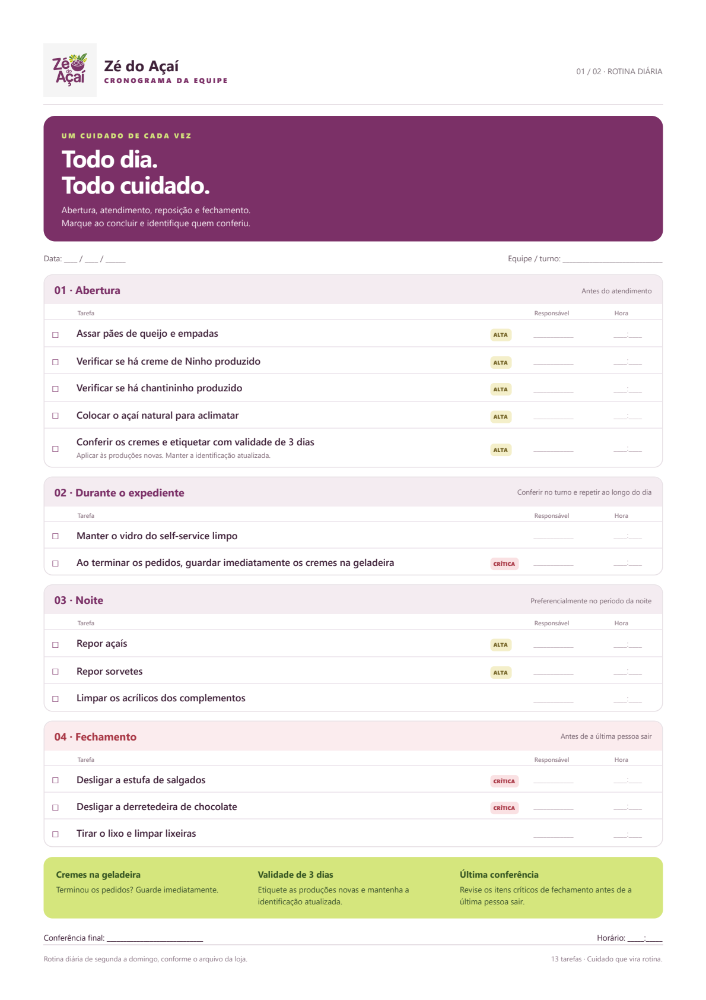
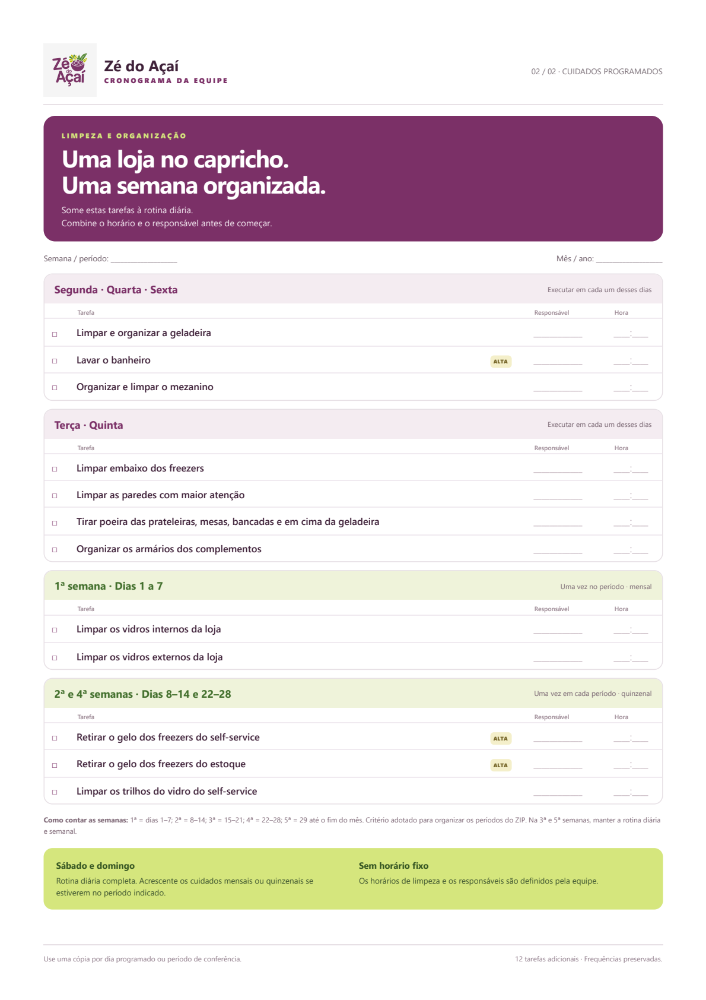

# Cronograma Zé do Açaí

Painel de checklist para a equipe da loja, com 25 tarefas de operação, limpeza e organização. O cronograma preserva as tarefas e frequências do material fornecido pela loja.

O painel pode ser usado pelo endereço publicado na Vercel, com registros compartilhados em Supabase/Postgres. Abrir [index.html](index.html) diretamente funciona em modo local; a sincronização exige o site e o banco configurados.

- **Dia:** abertura, expediente, noite, fechamento e cuidados programados da data.
- **Semana e mês:** visão dos cuidados recorrentes e dos períodos de execução.
- **Conferências:** nome de quem fez obrigatório, horário de conclusão e destaque para tarefas críticas e períodos programados.
- **Histórico:** estado atual das tarefas preenchidas, com exportação e importação em JSON.

Cada alteração é guardada primeiro no navegador e enviada ao banco quando há conexão e acesso autorizado. Outros computadores consultam as atualizações a cada 10 segundos enquanto o painel está visível, e também ao voltar à janela. O indicador **Salvo e sincronizado com a equipe** confirma o envio. Se duas pessoas alterarem a mesma ocorrência, o painel mostra as duas versões para a equipe escolher; alterações em tarefas diferentes não se sobrescrevem.

Use **Exportar** para guardar uma cópia de segurança. Importações com diferenças também exigem escolher a versão. Ao abrir a versão nova, os registros antigos deste navegador são migrados e o armazenamento original é preservado. Conclusões antigas sem nome ficam pendentes para que a equipe confira e informe quem fez.

## Deploy na Vercel

1. Na Vercel, crie um projeto e importe `julioguerreiro16b-ui/zedoacaicronograma` do GitHub.
2. Use a branch `main`, **Framework Preset: Other** e **Root Directory: .** (raiz do repositório, onde está `vercel.json`).
3. Crie ou escolha um projeto no **Supabase**. No **SQL Editor**, execute [a migração do checklist](supabase/migrations/202610020001_checklist.sql). Ela cria a tabela e as funções de leitura/gravação com proteção contra conflitos. A tabela usa RLS, e somente o servidor pode acessar essas funções. Mantenha a Data API habilitada para o schema `public`.
4. Na Vercel, em **Settings → Environment Variables**, configure no ambiente **Production**: `SUPABASE_URL` (URL do projeto), `SUPABASE_SECRET_KEY` (chave secreta `sb_secret_...`, disponível nas configurações de API Keys do Supabase) e `TEAM_ACCESS_CODE` (código aleatório da loja, com pelo menos 6 caracteres; recomendado: 32 ou mais). A chave `service_role` legada também é aceita em `SUPABASE_SERVICE_ROLE_KEY`. Não use a chave pública/anon. As chaves do Supabase ficam somente no servidor. Para gerar o código da equipe, execute localmente `node -e "console.log(require('node:crypto').randomBytes(24).toString('base64url'))"`.
5. Mantenha os comandos definidos pelo `vercel.json`: instalação `npm ci`, build `npm run build`, saída `public`. Use Node.js 22. Faça o deploy ou **Redeploy** depois de configurar as variáveis.
6. Em cada computador, abra o mesmo endereço do site, clique em **Conectar equipe** e informe o código da loja. O código fica na sessão daquela aba; ele não é a chave secreta do Supabase.

O build gera o painel a partir do template e do JSON, e publica os scripts do navegador, o HTML de impressão e o PDF em `public/`. A função `/api/records` chama as funções SQL do Supabase por HTTPS, guardando cada ocorrência com controle de versão e reenvio idempotente. Não é necessário executar PowerShell, Python ou Chrome no servidor. Referências: [chaves do Supabase](https://supabase.com/docs/guides/getting-started/api-keys), [funções do banco](https://supabase.com/docs/guides/database/functions) e [funções Node.js na Vercel](https://vercel.com/docs/functions/runtimes/node-js).

Após publicar, confira `/`, `/cronograma_para_imprimir.html` e `/cronograma_para_imprimir.pdf`. Conecte dois computadores, informe um nome e conclua uma tarefa no primeiro. Em até 10 segundos, ela deve aparecer concluída no segundo (ou desaparecer do checklist se for recorrente, ficando no Histórico). Recarregue ambos e confira os dados. Teste exportar e importar uma cópia.

Sem o banco e o código configurados, o painel avisa que está salvando somente neste navegador. Para levar registros de um arquivo local ou de outro domínio ao site, use **Exportar** no painel antigo e **Importar cópia** no endereço definitivo. A fila local pertence a cada navegador e endereço; o banco conectado ao projeto é a fonte compartilhada. Se usar previews, conecte um banco de testes separado do banco de produção.

Para atualizar as tarefas, execute `gerar_arquivos.ps1` localmente e atualize o PDF conforme as instruções de manutenção abaixo. Envie os arquivos gerados para `main`; com a integração GitHub da Vercel configurada, esse envio dispara o próximo deploy.

## Impressão

O [PDF completo](cronograma_para_imprimir.pdf) tem duas páginas A4 verticais. A [versão HTML para impressão](cronograma_para_imprimir.html) permite imprimir pelo navegador. No painel, o botão **Imprimir** imprime a visão selecionada.

## Frequências

As tarefas diárias seguem de segunda a domingo. A limpeza semanal ocorre em cada um dos dias indicados na fonte: segunda/quarta/sexta e terça/quinta.

Para organizar as semanas do mês, o painel usa blocos contados a partir do dia 1:

| Semana | Dias | Cuidados adicionais |
| --- | --- | --- |
| 1ª | 1–7 | Vidros internos e externos, uma vez no período |
| 2ª | 8–14 | Freezers e trilhos, uma vez no período |
| 3ª | 15–21 | Rotina diária e semanal |
| 4ª | 22–28 | Freezers e trilhos, uma vez no período |
| 5ª | 29 até o fim | Rotina diária e semanal |

A limpeza semanal cria uma ocorrência em **cada dia indicado**. Se não for feita, continua nos dias seguintes como atrasada, identificada pela data prevista. Uma nova ocorrência não apaga a anterior. O acompanhamento de pendências começa em `inicio_acompanhamento`, no JSON (02/10/2026).

Os vidros aparecem como pendência desde o início do mês, com destaque na 1ª semana. O primeiro cuidado quinzenal fica disponível no início do mês e ganha destaque na 2ª semana; o segundo entra no dia 22 e ganha destaque na 4ª. Ao terminar a janela, o destaque muda para **Atrasada**. As ocorrências não feitas continuam inclusive na virada do mês. A conclusão remove apenas aquela ocorrência do checklist e a mantém no Histórico, onde é possível **Reabrir tarefa**.

Tarefas diárias continuam vinculadas ao dia escolhido. Os cuidados de expediente continuam ao longo do turno, mesmo após a marcação de conferência. A autoria é o nome informado pela equipe, não uma identidade individual autenticada: o acesso ao banco usa o código compartilhado da loja.

## Arquivos e manutenção

[cronograma_loja.json](cronograma_loja.json) é a fonte das tarefas. [CRONOGRAMA_LOJA.md](CRONOGRAMA_LOJA.md) e [README_CODEX.md](README_CODEX.md) são os documentos originais fornecidos pela loja. [LEIA_ME.txt](LEIA_ME.txt) reúne as instruções de uso.

Após alterar o JSON, execute `gerar_arquivos.ps1` no PowerShell para atualizar `index.html` e `cronograma_para_imprimir.html`. O PDF precisa ser gerado novamente pela versão de impressão do navegador. Mantenha as duas imagens em `docs/` atualizadas com o PDF.

Para desenvolver: instale Node.js 22, execute `npm ci`, copie `.env.example` para `.env.local` e configure um banco de testes e seu código. Execute `npm run build` e `npm run dev`; abra `http://localhost:3000`.

`npm test` verifica as regras de calendário, migração, autoria, API e concorrência usando PostgreSQL local de testes (PGlite). `npm run test:browser` ou `node verificar.cjs` verifica dois perfis independentes de Chrome, sincronização, fila offline, conflitos, histórico e layout; usa um banco temporário, sem credenciais reais. No Windows, usa o Chrome instalado no caminho padrão; em outro ambiente, defina `CHROME_PATH`. `renderizar_pdf.py` renderiza o PDF e confere o texto das 25 tarefas usando o PDFium do LibreOffice no Windows.

As verificações locais executam a mesma migração e funções SQL em PostgreSQL de testes; não provisionam Supabase nem fazem deploy. A sincronização em produção só estará ativa depois de concluir a migração, configurar as variáveis e fazer o redeploy descritos acima.

## Identidade visual

O roxo, verde e amarelo-lima foram inspirados no [logotipo público do Zé do Açaí no iFood](https://www.ifood.com.br/delivery/nova-friburgo-rj/ze-do-acai-centro/33a2abd6-e622-4c02-a776-10ede491fa15). O perfil Instagram `@zedoacai.nf` não pôde ser consultado durante a criação.

Os horários específicos e os responsáveis são definidos pela equipe. A validade de três dias dos cremes reproduz a regra informada pela loja no arquivo original.
